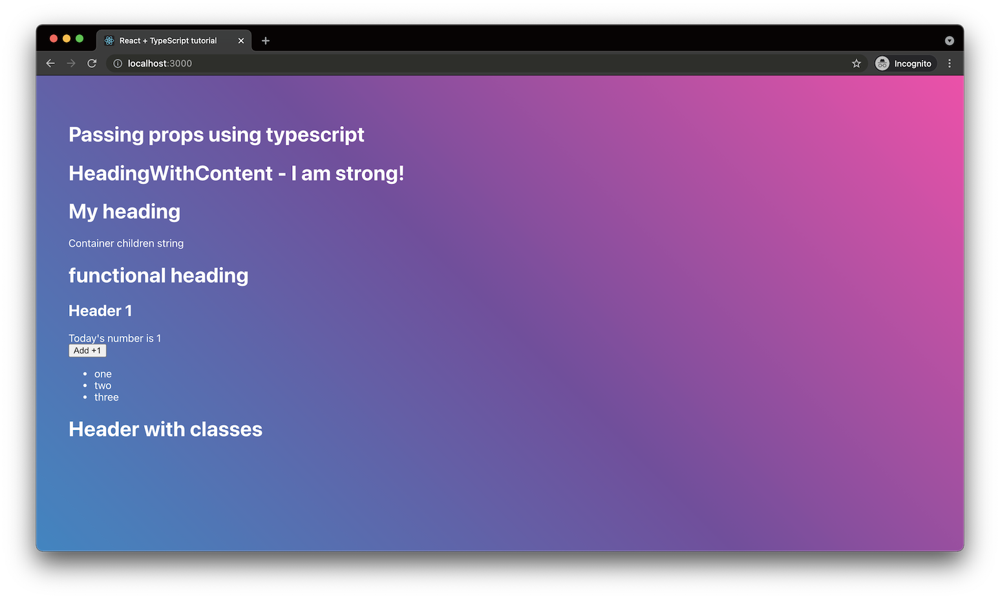

# React TypeScript tutorial (Herrington)

TypeScript basic tutorial

| \                | \                                                                                                                                                                                  |
| ---------------- | ---------------------------------------------------------------------------------------------------------------------------------------------------------------------------------- |
| Deploy status    | /                                                                                                                                                                                  |
| Deploy preview   | /                                                                                                                                                                                  |
| Project typology | 📒 Step by step from tutorial [Typescript for React Components From Beginners to Masters - Jack Herrington](https://www.youtube.com/watch?v=z8lDwLKthr8&ab_channel=JackHerrington) |



## 🔥 Tech stack

| Purpose    | Technology |
| :--------- | :--------- |
| Templating | TS         |

## 🌊 Run development mode

```shell
npm start
```

## 🧳 Build setup

Not available

## 🌿 Branches

| Branch name | Use        |
| :---------- | :--------- |
| `main`      | production |
